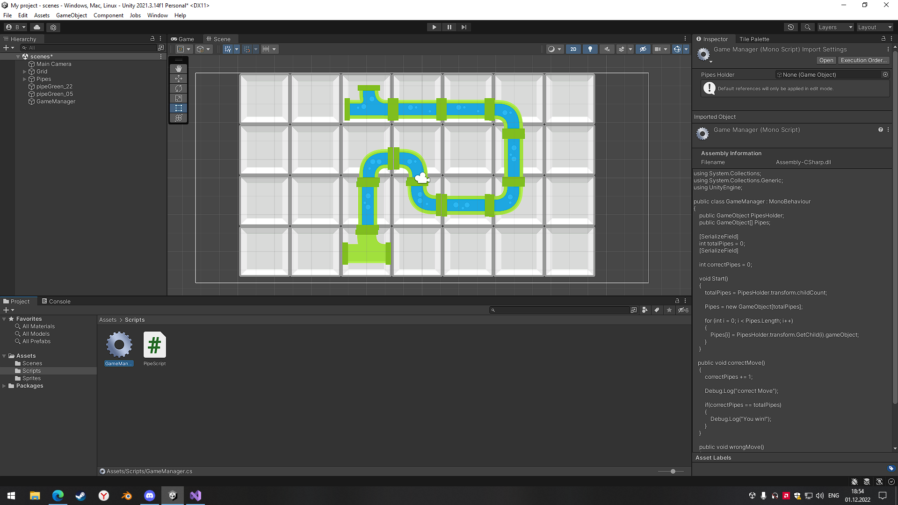

  Выполнил: Боровлев В.О
  

 Группа: ЭВТ-70
  

 Игровой движок: Unity 2021.3.9f1
  

 Название работы: Изучение Puzzle
  

  

  

Рисунок 17.1 - Геймплей игры 

  

Рисунок 17.2 - Код объекта Player.cs

  

Рисунок 17.3 - Папка Sprites

  

Рисунок 17.4 - Игровое поле

  

Рисунок 17.5 - Игровое поле

